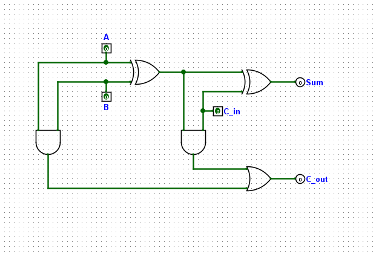
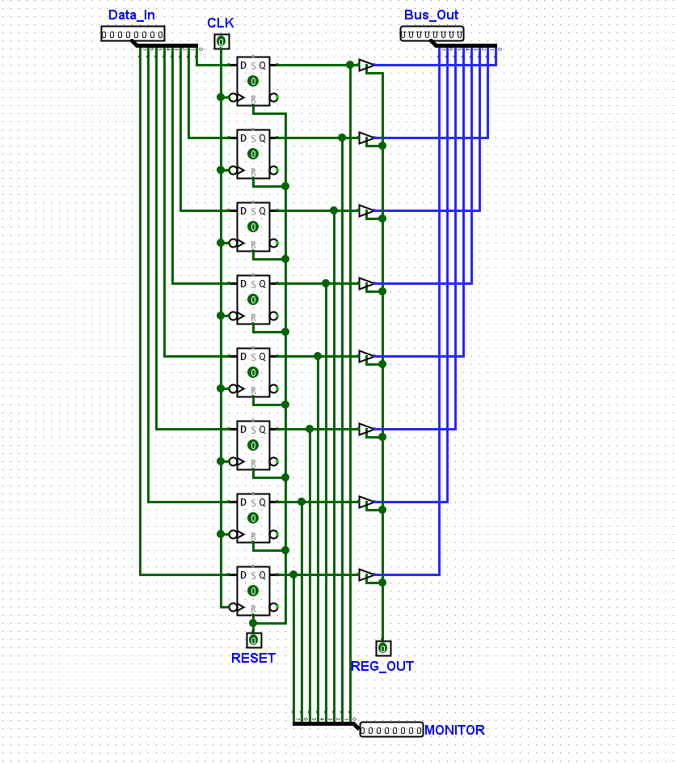
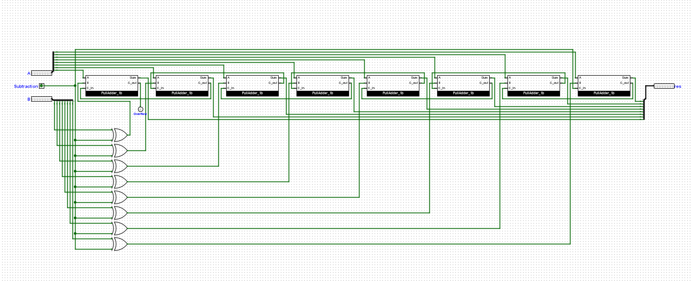
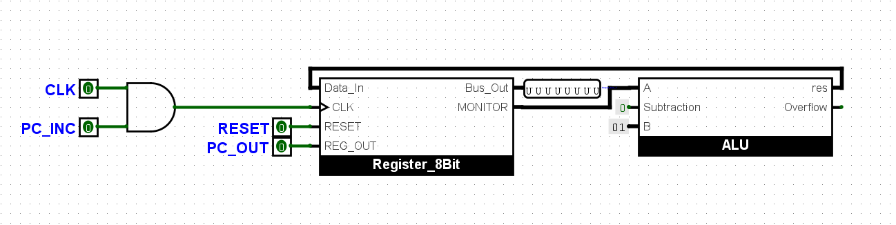
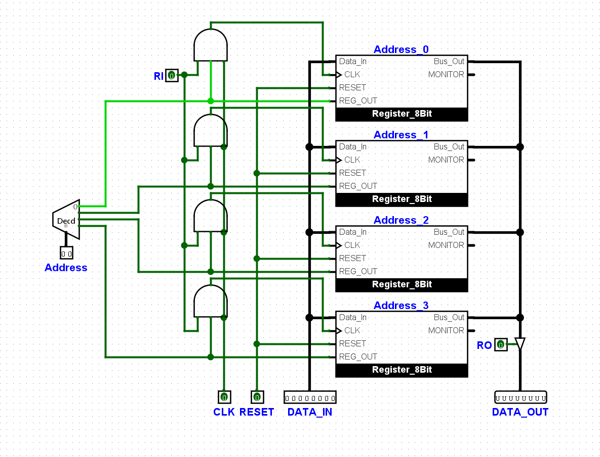
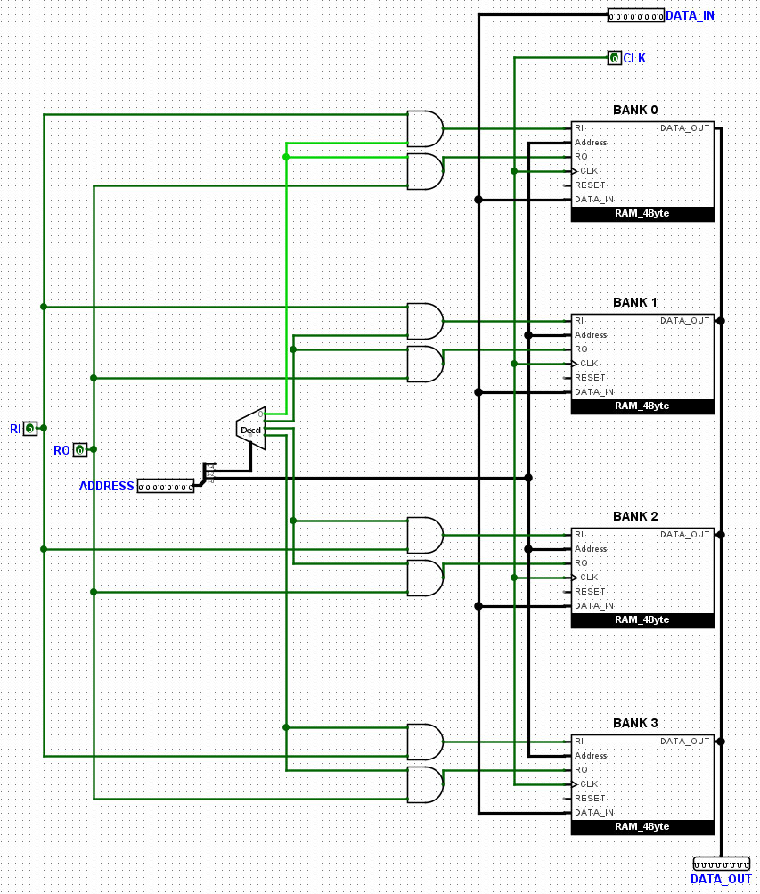
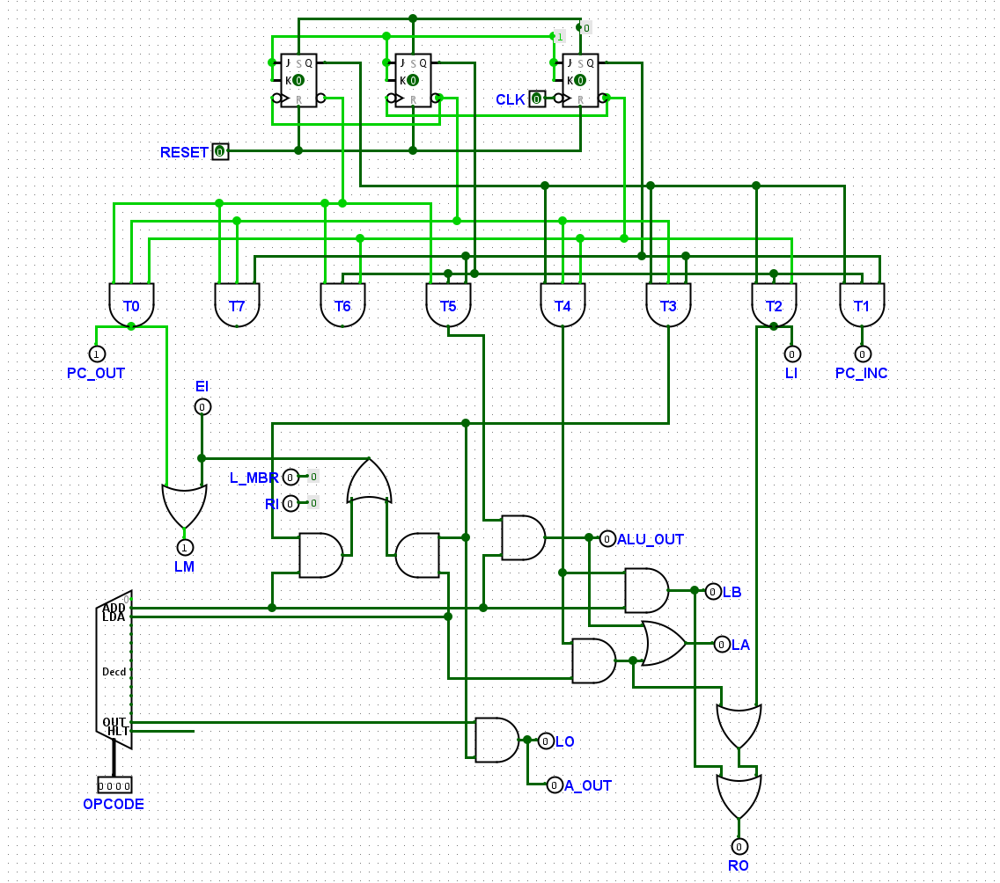
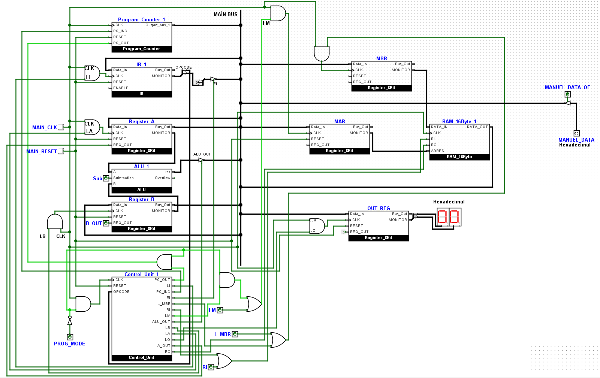

# 🖥️ Custom 8-Bit CPU — SAP-1 Based Processor

A fully custom 8-bit processor based on the **SAP-1 (Simple As Possible)** architecture, designed and built **entirely from scratch** — starting from the lowest possible level.

## Built From the Ground Up — No Pre-Built Components

This project follows a strict **bottom-up design philosophy**. Every single component in this CPU was built by hand, starting from the most fundamental logic gates. **No pre-built modules, no library components, no behavioral shortcuts** — everything you see here was constructed from AND, OR, XOR, and NOT gates upward.

Here is the exact build order that was followed:

```
Level 0 — Logic Gates (AND, OR, XOR, NOT)
  └─► Level 1 — 1-Bit Full Adder (from gates)
        └─► Level 2 — 8-Bit ALU (chain of 8 full adders)
              └─► Level 3 — Program Counter (register + ALU for increment)
Level 0 — Logic Gates + Flip-Flops
  └─► Level 1 — 8-Bit Register Unit (D flip-flops + tri-state output)
        └─► Level 2 — 4-Byte SRAM Bank (4 registers + address decoder)
              └─► Level 3 — 16-Byte RAM (4 SRAM banks + bank decoder)
Level 0 — Logic Gates + Step Counter
  └─► Level 1 — Control Unit (FSM with opcode decoder)

Final Assembly — CPU Top Module (all components connected via 8-bit tri-state bus)
```

The entire design was **first prototyped and verified in Logisim Evolution** at the gate level. Once each circuit was working correctly in Logisim, it was **manually translated into structural Verilog HDL** — every wire, every gate, every connection in the Verilog code directly mirrors its corresponding Logisim schematic. The Verilog is not an independent rewrite; it is a **faithful 1:1 translation** of the Logisim circuits.

| Phase | Tool | Purpose |
|:---:|---|---|
| 1 | **Logisim Evolution** | Circuit design, visual prototyping, interactive testing |
| 2 | **Verilog HDL** | Structural translation of Logisim circuits into code |
| 3 | **Icarus Verilog** | Compilation and simulation of Verilog code |
| 4 | **GTKWave** | Waveform analysis and verification |

---

## 📐 Architecture Overview

```
┌──────────────────────────────────────────────────────────────────────────┐
│                           8-BIT MAIN BUS                                │
├──────┬──────┬───────┬───────┬──────┬───────┬──────┬───────┬─────────────┤
│      │      │       │       │      │       │      │       │             │
│   ┌──┴──┐┌──┴──┐ ┌──┴──┐┌──┴──┐┌──┴───┐┌──┴──┐┌──┴──┐┌──┴──┐┌────────┴──┐
│   │ PC  ││ IR  │ │ A   ││ B   ││ ALU  ││ MAR ││ MBR ││ OUT ││  RAM 16B  │
│   │     ││     │ │ Reg ││ Reg ││ ADD/ ││     ││     ││ Reg ││(4 banks × │
│   │     ││     │ │     ││     ││ SUB  ││     ││     ││     ││ 4 cells)  │
│   └─────┘└─────┘ └─────┘└─────┘└──────┘└─────┘└─────┘└─────┘└───────────┘
│                                                                          │
│                       ┌───────────────────┐                              │
│                       │   CONTROL UNIT    │                              │
│                       │  (6-Step FSM)     │                              │
│                       └───────────────────┘                              │
│                                                                          │
│               ┌────────────────────────────────┐                         │
│               │  MANUAL PROGRAMMING INTERFACE  │                         │
│               │  (PROG_MODE / MANUEL_DATA)     │                         │
│               └────────────────────────────────┘                         │
└──────────────────────────────────────────────────────────────────────────┘
```

| Feature | Detail |
|---|---|
| **Architecture** | SAP-1 based, custom extensions |
| **Data Bus** | 8-bit shared tri-state bus |
| **Address Space** | 16 bytes (4-bit address, `0x0`–`0xF`) |
| **Instruction Format** | `[OPCODE (4-bit)][ADDRESS (4-bit)]` |
| **ALU Operations** | Addition & Subtraction (two's complement) |
| **RAM** | 16 bytes, fully register-based (no behavioral arrays) |
| **Clock** | Testbench: 125 MHz (8ns period) |
| **Clock Edges** | Data latch: `posedge CLK` / Step counter: `negedge CLK` |
| **Dual-Mode** | Programming Mode + Execution Mode |

---

## 📁 Project Structure

```
Custom_8Bit_CPU_Project/
│
├── rtl/                              # Synthesizable Verilog source code
│   ├── cpu_top_sap1.v                #   Top module — connects everything
│   ├── control_unit_sap1_custom.v    #   Control Unit (6-step FSM)
│   ├── alu_8b_add_sub.v              #   8-bit ALU (adder/subtractor)
│   ├── program_counter.v             #   Program Counter (register + ALU)
│   ├── ram_16byte.v                  #   16-Byte RAM (4 banks × 4 cells)
│   ├── sram_4byte.v                  #   4-Byte SRAM Bank
│   ├── register_unit_8b.v            #   8-bit Register with tri-state output
│   └── adder_1b.v                    #   1-bit Full Adder (gate-level)
│
├── tb/                               # Testbench and test data
│   ├── cpu_tb.v                      #   CPU simulation testbench
│   └── program.hex                   #   Sample program (HEX format)
│
├── circuits/                         # Logisim Evolution circuit files
│   ├── Top_Module.circ              #   Complete CPU schematic
│   ├── Control_Unit.circ            #   Control Unit schematic
│   ├── ALU.circ                     #   ALU schematic
│   ├── Prog_Counter.circ           #   Program Counter schematic
│   ├── RAM_16B.circ                #   16-Byte RAM schematic
│   ├── SRAM_4B.circ               #   4-Byte SRAM Bank schematic
│   ├── Register_Unit.circ         #   Register Unit schematic
│   └── Adder_1b.circ             #   1-Bit Full Adder schematic
│
├── docs/                             # Documentation
│   ├── logisim_schematics/           #   Circuit schematic screenshots (PNG)
│   │   ├── CPU_Top_Module.png
│   │   ├── Control_Unit.png
│   │   ├── ALU.png
│   │   ├── Program_Counter.png
│   │   ├── RAM_16B.png
│   │   ├── SRAM_4B.png
│   │   ├── Register_Unit.png
│   │   └── FullAdder_1b.png
│   └── waveforms/                    #   Simulation waveform screenshots
│       └── waveform_add_0D_07.png
│
└── README.md
```

---

## 🧩 Module Hierarchy

```
cpu_top_sap1 (TOP MODULE)
├── control_unit_sap1_custom        — FSM, generates all control signals
├── program_counter                 — Counts instruction addresses
│   ├── register_unit_8b            — Stores current PC value
│   └── alu_8b_add_sub              — Computes PC + 1
│       └── full_adder_1b (×8)      — Ripple-carry chain
├── register_unit_8b (IR)           — Holds current instruction
├── register_unit_8b (Register A)   — Accumulator
├── register_unit_8b (Register B)   — Second operand
├── alu_8b_add_sub (Main ALU)       — Performs A + B or A - B
│   └── full_adder_1b (×8)          — Ripple-carry chain
├── register_unit_8b (MAR)          — Memory Address Register
├── register_unit_8b (MBR)          — Memory Buffer Register
├── ram_16byte                      — Main memory
│   └── sram_4byte (×4 banks)       — Each bank holds 4 bytes
│       └── register_unit_8b (×4)   — Individual memory cells
└── register_unit_8b (Output Reg)   — Drives OUT_PORT
```

**Component count:** 24× `register_unit_8b` | 16× `full_adder_1b` | 2× `alu_8b_add_sub`

---

## 📋 Instruction Set

### The 4+4 Split — How Instructions Are Encoded

Every instruction in this CPU is exactly **1 byte (8 bits)** wide. That single byte is split into two halves:

```
   ┌───────────────────────────────────────┐
   │  7   6   5   4 │  3   2   1   0      │
   │ ─────────────── │ ─────────────────── │
   │    OPCODE       │    ADDRESS          │
   │  (what to do)   │  (where in RAM)     │
   └───────────────────────────────────────┘
         4 bits            4 bits
```

- **Upper nibble (bits 7–4):** The **opcode** — tells the CPU *what operation* to perform
- **Lower nibble (bits 3–0):** The **address operand** — tells the CPU *which RAM address* to use

Since the address field is only 4 bits, the CPU can address **2⁴ = 16 memory locations** (0x0 through 0xF). This is why our RAM is exactly 16 bytes.

### Decoding Example from `program.hex`

Let's decode the byte `0x24` step by step:

```
Hex:      2        4
Binary:   0010     0100
          ────     ────
          OPCODE   ADDRESS
          = LDA    = 0x4

Result:   LDA 0x4  →  "Load the value at RAM address 4 into Register A"
```

Another example — `0x15`:

```
Hex:      1        5
Binary:   0001     0101
          ────     ────
          OPCODE   ADDRESS
          = ADD    = 0x5

Result:   ADD 0x5  →  "Add the value at RAM address 5 to Register A"
```

For instructions that don't use an address (like `OUT` and `HLT`), the lower nibble is ignored:

```
Hex:      E        0              F        0
Binary:   1110     0000           1111     0000
          ────     ────           ────     ────
          OUT      (ignored)      HLT      (ignored)
```

### Complete Instruction Table

| Opcode (Binary) | Hex | Mnemonic | Format | Operation | Clock Cycles |
|:---:|:---:|:---:|:---:|---|:---:|
| `0001` | `1x` | **ADD** | `0001_AAAA` | `A ← A + RAM[AAAA]` | 6 |
| `0010` | `2x` | **LDA** | `0010_AAAA` | `A ← RAM[AAAA]` | 5 |
| `1110` | `Ex` | **OUT** | `1110_xxxx` | `OUT_PORT ← A` | 4 |
| `1111` | `Fx` | **HLT** | `1111_xxxx` | Halt (freeze step counter) | 4 |

> **Note:** The ALU hardware supports subtraction via two's complement (the `MANUAL_Sub` pin), but a **SUB** opcode is not yet implemented in the Control Unit. There are also no jump or branch instructions — the PC can only increment sequentially.

---

## ⚙️ Control Unit — State Machine

The Control Unit uses a **3-bit step counter** (values 0–5) that advances on **`negedge CLK`**. This half-cycle offset ensures control signals are set up before the next rising edge latches data.

### Fetch Cycle (Common to All Instructions)

Every instruction begins with the same 3-step fetch sequence:

| Step | Active Signals | What Happens |
|:---:|---|---|
| **T0** | `PC_OUT=1`, `LM=1` | PC value → Bus → MAR *(load the address to fetch from)* |
| **T1** | `PC_INC=1` | PC ← PC + 1 *(move to next instruction)* |
| **T2** | `LI=1`, `RO=1` | RAM[MAR] → Bus → IR *(load the instruction byte)* |

### Execute Cycle (Instruction-Specific)

After fetch, the behavior depends on the opcode stored in IR[7:4]:

| Instruction | T3 | T4 | T5 |
|:---:|---|---|---|
| **LDA** | `EI, LM` → IR[3:0] → MAR | `RO, LA` → RAM[MAR] → A | — |
| **ADD** | `EI, LM` → IR[3:0] → MAR | `RO, LB` → RAM[MAR] → B | `ALU_OUT, LA` → A+B → A |
| **OUT** | `LO, A_OUT` → A → Output Reg | — | — |
| **HLT** | `halted ← 1` (counter frozen) | — | — |

### Timing Diagram

```
          T0       T1       T2       T3       T4       T5
CLK    ──┐  ┌──┐  ┌──┐  ┌──┐  ┌──┐  ┌──┐  ┌──┐  ┌──┐  ┌──
         └──┘  └──┘  └──┘  └──┘  └──┘  └──┘  └──┘  └──┘
            ↑     ↑     ↑     ↑     ↑     ↑     ↑     ↑
            │     │     │     │     │     │     │     │
          Data   Data  Data  Data  Data  Data  Data  Data
         latch  latch latch latch latch latch latch latch
       ↑     ↑     ↑     ↑     ↑     ↑     ↑     ↑
       │     │     │     │     │     │     │     │
     Step  Step  Step  Step  Step  Step  Step  Step
    change change change ...
   (negedge)

Step counter advances on NEGEDGE → signals are ready BEFORE the next POSEDGE
```

### Control Signal Reference

| Signal | Full Name | Direction | Function |
|---|---|---|---|
| `PC_OUT` | PC Output Enable | PC → Bus | Drive PC value onto the bus |
| `PC_INC` | PC Increment | — | Increment program counter by 1 |
| `LI` | Load IR | Bus → IR | Latch bus value into Instruction Register |
| `LM` | Load MAR | Bus → MAR | Latch bus value into Memory Address Register |
| `EI` | Enable IR | IR → Bus | Drive IR[3:0] (zero-extended) onto the bus |
| `RO` | RAM Out | RAM → Bus | Drive RAM[MAR] onto the bus |
| `RI` | RAM In | MBR → RAM | Write MBR value into RAM[MAR] |
| `L_MBR` | Load MBR | Bus → MBR | Latch bus value into Memory Buffer Register |
| `LA` | Load A | Bus → A | Latch bus value into Register A |
| `LB` | Load B | Bus → B | Latch bus value into Register B |
| `ALU_OUT` | ALU Output | ALU → Bus | Drive ALU result onto the bus |
| `A_OUT` | A Output | A → Bus | Drive Register A value onto the bus |
| `LO` | Load Output | Bus → OUT | Latch bus value into Output Register |

---

## 🔌 Module Details

Every module listed below was first built and tested as a Logisim Evolution circuit, then translated line-by-line into structural Verilog. The Verilog source code is a direct mirror of the Logisim schematics.

### `full_adder_1b` — 1-Bit Full Adder

The most fundamental arithmetic building block. Built purely from logic gates:

| Output | Boolean Expression | Gate Count |
|---|---|:---:|
| `Sum` | `A ⊕ B ⊕ Cin` | 2× XOR |
| `Cout` | `(A · B) + ((A ⊕ B) · Cin)` | 2× AND, 1× OR |

| Property | Value |
|---|---|
| Total gates | 5 (2 XOR + 2 AND + 1 OR) |
| Instances in CPU | 16 (8 in main ALU + 8 in PC incrementer) |
| Logisim source | `circuits/Adder_1b.circ` |
| Verilog source | `rtl/adder_1b.v` |

### `register_unit_8b` — 8-Bit Register Unit

The universal storage building block — reused across the entire CPU:

| Feature | Description |
|---|---|
| **Storage** | 8× D flip-flops, latches `Data_In` on rising clock edge |
| **Async reset** | Clears to `0x00` when `RESET` is asserted |
| **Tri-state output** | `Bus_Out` drives the bus only when `REG_OUT=1`, otherwise high-Z (`8'bz`) |
| **Monitor port** | `MONITOR` always reflects the stored value (debug / internal wiring) |
| **Instances in CPU** | 24× (IR, A, B, MAR, MBR, OUT, PC register, 16 RAM cells) |
| **Logisim source** | `circuits/Register_Unit.circ` |
| **Verilog source** | `rtl/register_unit_8b.v` |

### `alu_8b_add_sub` — 8-Bit ALU (Adder/Subtractor)

A structural ripple-carry adder/subtractor built from 8 chained `full_adder_1b` instances:

| `Subtraction` | Operation | Formula | How It Works |
|:---:|:---:|---|---|
| `0` | Addition | `A + B` | B passes through XOR gates unchanged |
| `1` | Subtraction | `A + (~B) + 1 = A − B` | XOR inverts all B bits; `Subtraction` feeds first `C_in` as +1 |

| Property | Value |
|---|---|
| Architecture | 8-bit ripple-carry |
| Sub-components | 8× `full_adder_1b` + 8× XOR gates |
| Instances in CPU | 2 (main ALU + PC incrementer) |
| Logisim source | `circuits/ALU.circ` |
| Verilog source | `rtl/alu_8b_add_sub.v` |

### `program_counter` — Program Counter

Instead of a dedicated counter chip, the PC reuses the ALU module to compute `PC + 1`:

| Component | Role | Connection |
|---|---|---|
| `register_unit_8b` | Stores current PC value | `MONITOR` → ALU input A |
| `alu_8b_add_sub` | Computes `PC + 1` | B hardwired to `0x01`, Subtraction = `0` |
| AND gate | Gated clock (`CLK & PC_INC`) | Output → Register CLK |
| `PC_OUT` pin | Tri-state bus enable | Connected to Register `REG_OUT` |

| Property | Value |
|---|---|
| Feedback loop | Register → MONITOR → ALU (+1) → result → Register Data_In |
| Logisim source | `circuits/Prog_Counter.circ` |
| Verilog source | `rtl/program_counter.v` |

### `sram_4byte` — 4-Byte SRAM Bank

Four register units combined into an addressable memory bank:

| Component | Role |
|---|---|
| 2-to-4 Decoder | Converts 2-bit address → one-hot selection (which register?) |
| 4× AND gates | Gated write clock: `RI & CLK & dec_out[n]` (only selected register receives clock) |
| 4× `register_unit_8b` | Individual memory cells sharing `DATA_IN`, `CLK`, `RESET` |
| Tri-state bus | All 4 registers drive shared internal bus; only addressed one is active |
| RO gate | `DATA_OUT` driven only when `RO=1` |

| Property | Value |
|---|---|
| Capacity | 4 bytes (2-bit address) |
| Logisim source | `circuits/SRAM_4B.circ` |
| Verilog source | `rtl/sram_4byte.v` |

### `ram_16byte` — 16-Byte RAM

The main memory — 4 SRAM banks combined via splitter-based address decoding:

| Address Bits | Role | Routing |
|:---:|---|---|
| `[7:4]` | Unused | Reserved for future expansion (up to 256 bytes) |
| `[3:2]` | Bank select | Splitter → 2-to-4 Decoder → selects 1 of 4 banks |
| `[1:0]` | Cell select | Splitter → directly to each bank's Address input |

| Bank | Select `[3:2]` | Addresses | Physical Cells |
|:---:|:---:|:---:|---|
| Bank 0 | `00` | `0x0`–`0x3` | `bank_0.reg_0` – `bank_0.reg_3` |
| Bank 1 | `01` | `0x4`–`0x7` | `bank_1.reg_0` – `bank_1.reg_3` |
| Bank 2 | `10` | `0x8`–`0xB` | `bank_2.reg_0` – `bank_2.reg_3` |
| Bank 3 | `11` | `0xC`–`0xF` | `bank_3.reg_0` – `bank_3.reg_3` |

| Property | Value |
|---|---|
| Total capacity | 16 bytes (4-bit address space) |
| Architecture | No behavioral `reg [7:0] mem[0:15]` — fully structural from registers |
| Logisim source | `circuits/RAM_16B.circ` |
| Verilog source | `rtl/ram_16byte.v` |

### `control_unit_sap1_custom` — Control Unit

The FSM brain of the CPU — orchestrates all operations:

| Component | Role |
|---|---|
| 3× JK Flip-Flops | 3-bit step counter, advances on `negedge CLK` |
| 8× Timing decoders | T0–T7 one-hot signals decoded from counter value |
| 4-bit Decoder | OPCODE → one-hot instruction signals (ADD, LDA, OUT, HLT) |
| AND/OR gate network | Combines timing × instruction → 13 control outputs |
| Halt flag | `T3 & HLT` → freezes step counter permanently (until reset) |

| Property | Value |
|---|---|
| `L_MBR` and `RI` | Hardwired to `0` — only used via manual override pins in PROG_MODE |
| Logisim source | `circuits/Control_Unit.circ` |
| Verilog source | `rtl/control_unit_sap1_custom.v` |

### `cpu_top_sap1` — Top Module

The integration layer that connects all components via the 8-bit tri-state `main_bus`.

**Dual-mode operation:**

| Mode | `PROG_MODE` | Description |
|---|:---:|---|
| **Programming Mode** | `1` | CU clock is gated off (`cu_clk = MAIN_CLK & ~PROG_MODE`), CU bus-driving signals are masked, manual control pins are active |
| **Execution Mode** | `0` | CU runs normally, manual pins are OR'd with CU signals |

**Bus drivers (all tri-state, only one active at a time):**

| Driver | Condition | Data on Bus |
|---|---|---|
| Program Counter | `pc_out = 1` | Current PC value |
| Instruction Register | `ei = 1` | `{4'b0000, IR[3:0]}` — zero-extended lower nibble |
| Register A | `a_out = 1` | A register contents |
| ALU | `alu_out = 1` | ALU result (A ± B) |
| RAM | `ro = 1` | RAM[MAR] contents |
| Manual Data Input | `MANUEL_DATA_OE = 1` | External data (programming mode) |

---

## 🎮 Running on Logisim Evolution

You can run the CPU interactively in **Logisim Evolution** using the circuit files in the `circuits/` directory. Open `Top_Module.circ` to see the complete CPU.

The CPU operates in two phases: first you **program the RAM** (bootloader), then you **let the CPU execute**.

### Phase 1: System Reset

1. Set the **`PROG_MODE`** switch to `1` (this puts the CPU to sleep — the Control Unit's clock is disabled)
2. Press the **`MAIN_RESET`** button once and release (all registers, PC, and the step counter are cleared to zero)

### Phase 2: Programming the RAM (Bootloader)

In Programming Mode, you manually load instructions and data into RAM one byte at a time. Each byte requires **3 clock pulses** — one to set the address (MAR), one to buffer the data (MBR), and one to write into RAM.

The process for writing a single byte to RAM is always:

```
1. Enter the ADDRESS on the manual data input → pulse LM → (address is now in MAR)
2. Enter the DATA on the manual data input    → pulse L_MBR → (data is now in MBR)
3. Pulse RI → (MBR data is written into RAM at the MAR address)
```

> **"Pulse"** means: set the signal to `1`, click `MAIN_CLK` once (rising edge latches the data), then set the signal back to `0`.

#### Example: Loading a Program That Computes 13 + 7

We will load the following program into RAM:

| Address | Hex Value | Instruction | Description |
|:---:|:---:|:---:|---|
| `0x0` | `0x2E` | `LDA 0xE` | Load value at address 0xE into A |
| `0x1` | `0x1F` | `ADD 0xF` | Add value at address 0xF to A |
| `0x2` | `0xE0` | `OUT` | Output A to the display |
| `0xE` | `0x0D` | *(data: 13)* | First number |
| `0xF` | `0x07` | *(data: 7)* | Second number |

**Step-by-step loading:**

---

**Byte 1 — Instruction: `LDA 0xE` at address `0x0`**

1. Enter **`0x00`** on the 8-bit manual data input (this is the target address)
2. Set **LM** to `1` → click **MAIN_CLK** once → set **LM** to `0`
   - *Address `0x00` is now locked in the MAR*
3. Enter **`0x2E`** on the 8-bit manual data input (this is the instruction: LDA 0xE)
4. Set **L_MBR** to `1` → click **MAIN_CLK** once → set **L_MBR** to `0`
   - *Instruction `0x2E` is now in the MBR*
5. Set **RI** to `1` → click **MAIN_CLK** once → set **RI** to `0`
   - *`0x2E` is written to RAM[0x0] ✓*

---

**Byte 2 — Instruction: `ADD 0xF` at address `0x1`**

1. Enter **`0x01`** → **LM** pulse → *(MAR = 0x01)*
2. Enter **`0x1F`** → **L_MBR** pulse → *(MBR = 0x1F)*
3. **RI** pulse → *RAM[0x1] = 0x1F ✓*

---

**Byte 3 — Instruction: `OUT` at address `0x2`**

1. Enter **`0x02`** → **LM** pulse → *(MAR = 0x02)*
2. Enter **`0xE0`** → **L_MBR** pulse → *(MBR = 0xE0)*
3. **RI** pulse → *RAM[0x2] = 0xE0 ✓*

---

**Byte 4 — Data: `13` at address `0xE`**

1. Enter **`0x0E`** → **LM** pulse → *(MAR = 0x0E)*
2. Enter **`0x0D`** → **L_MBR** pulse → *(MBR = 0x0D — this is 13 in decimal!)*
3. **RI** pulse → *RAM[0xE] = 0x0D ✓*

---

**Byte 5 — Data: `7` at address `0xF`**

1. Enter **`0x0F`** → **LM** pulse → *(MAR = 0x0F)*
2. Enter **`0x07`** → **L_MBR** pulse → *(MBR = 0x07 — this is 7 in decimal!)*
3. **RI** pulse → *RAM[0xF] = 0x07 ✓*

---

### Phase 3: Execution

1. Set the manual data input pins to **`0x00`** (clear the bus — hand it back to the CPU)
2. Set **`PROG_MODE`** to `0` (control is now transferred to the CPU)
3. Press **`MAIN_RESET`** once and release (PC and step counter are reset to 0, ready for T0)
4. Start the automatic clock from the Logisim menu: **Simulate → Tick Enabled** (or press **Ctrl+K**)

The CPU will now execute the program automatically:
- **T0–T4:** Fetch and execute `LDA 0xE` → Register A = 13
- **T0–T5:** Fetch and execute `ADD 0xF` → Register A = 13 + 7 = 20
- **T0–T3:** Fetch and execute `OUT` → Output Register = 20 (displayed as `0x14`)

The hexadecimal display in Logisim will show **`14`** (which is 20 in decimal). 🎉

---

## 📝 Understanding `program.hex` — The Machine Code File

The `program.hex` file contains the machine code that gets loaded into RAM during Verilog simulation. It is a plain text file where each line represents **one byte in hexadecimal**.

### Current Contents

```
24  // Address 0x0: LDA 0x4  (Load from address 4)
15  // Address 0x1: ADD 0x5  (Add from address 5)
E0  // Address 0x2: OUT      (Output result)
F0  // Address 0x3: HLT      (Halt processor)
0D  // Address 0x4: First Number  (Decimal 13)
07  // Address 0x5: Second Number (Decimal 7)
```

### Decoding Each Line

```
Line 1:  24 hex  =  0010 0100 binary
                     ──── ────
                     0010 = LDA (opcode)
                     0100 = address 0x4
                     → "Load the value stored at RAM[4] into Register A"

Line 2:  15 hex  =  0001 0101 binary
                     ──── ────
                     0001 = ADD (opcode)
                     0101 = address 0x5
                     → "Add the value stored at RAM[5] to Register A"

Line 3:  E0 hex  =  1110 0000 binary
                     ──── ────
                     1110 = OUT (opcode)
                     0000 = (not used)
                     → "Copy Register A to the Output Port"

Line 4:  F0 hex  =  1111 0000 binary
                     ──── ────
                     1111 = HLT (opcode)
                     0000 = (not used)
                     → "Stop the processor"

Line 5:  0D hex  =  13 decimal  → raw data (first number)
Line 6:  07 hex  =   7 decimal  → raw data (second number)
```

### Execution Flow Visualization

```
Step 1: PC=0 → Fetch 0x24 → LDA 0x4
        PC=1   Go to RAM[4], read 0x0D (13)
               Register A ← 13

Step 2: PC=1 → Fetch 0x15 → ADD 0x5
        PC=2   Go to RAM[5], read 0x07 (7)
               Register B ← 7
               ALU computes: 13 + 7 = 20
               Register A ← 20

Step 3: PC=2 → Fetch 0xE0 → OUT
        PC=3   Output Register ← Register A (20)
               OUT_PORT = 0x14

Step 4: PC=3 → Fetch 0xF0 → HLT
               halted flag set → CPU stops ■
```

### How to Modify the Program

#### Example 1: Change the numbers to compute 25 + 30

```
24        // LDA 0x4   — load first number from address 4
15        // ADD 0x5   — add second number from address 5
E0        // OUT       — output the result
F0        // HLT       — halt
19        // 0x19 = 25 decimal (first number)  ← CHANGED
1E        // 0x1E = 30 decimal (second number) ← CHANGED
```

Expected result: `OUT_PORT = 0x37` (55 in decimal)

#### Example 2: Add three numbers (10 + 20 + 30)

```
26        // LDA 0x6   — load 10 from address 6
17        // ADD 0x7   — add 20 from address 7
18        // ADD 0x8   — add 30 from address 8
E0        // OUT       — output the result
F0        // HLT       — halt
00        // (unused — address 5)
0A        // 0x0A = 10 decimal (at address 6)
14        // 0x14 = 20 decimal (at address 7)
1E        // 0x1E = 30 decimal (at address 8)
```

Expected result: `OUT_PORT = 0x3C` (60 in decimal)

#### Example 3: Subtract two numbers (50 - 20) — requires adding SUB to Control Unit

Currently, subtraction is only available via the `MANUAL_Sub` pin. To use it as an instruction, you would need to add a `SUB` opcode (e.g., `0011`) to the Control Unit's decode logic.

> **Tip:** When converting decimal to hex for the data bytes, remember:
> - Decimal `13` → Hex `0D`
> - Decimal `25` → Hex `19`
> - Decimal `100` → Hex `64`
> - Decimal `255` → Hex `FF` (maximum value for 8 bits)

---

## 🔄 From Logisim to Verilog — The Translation Process

The Verilog code in this project is **not an independent implementation** — it is a **direct, line-by-line translation** of the Logisim Evolution circuits. Every gate, every wire, every connection visible in the Logisim schematics has a corresponding `assign` statement or module instantiation in the Verilog source. The Logisim circuits are the **original design**; the Verilog code is their textual representation.

This approach ensures that what runs in simulation (`iverilog`) behaves identically to what you see in the Logisim interactive environment. Here is how each Logisim concept maps to Verilog:

### Translation Mapping

| Logisim Concept | Verilog Equivalent |
|---|---|
| Wires and tunnels | `wire` declarations |
| Input/Output pins | `input wire` / `output wire` ports |
| AND, OR, XOR, NOT gates | `&`, `\|`, `^`, `~` operators via `assign` |
| Subcircuit instances | Module instantiation |
| Splitters (bus split/merge) | Bit slicing `[7:4]`, `[3:0]`, concatenation `{a, b}` |
| Controlled buffers (tri-state) | Ternary operator `condition ? data : 8'bz` |
| D Flip-Flop | `always @(posedge CLK)` with `reg` |
| Clock input | `CLK` port, `always` sensitivity list |
| Constants | Direct bit literals `8'b00000001`, `1'b0` |
| Probe / LED | `MONITOR` output wire (always-on debug port) |

### Example: 1-Bit Full Adder

**Logisim circuit:**



**Verilog translation:**

```verilog
module full_adder_1b (
    input  wire A,
    input  wire B,
    input  wire C_in,
    output wire Sum,
    output wire C_out
);
    wire xor_ab  = A ^ B;            // XOR gate
    wire and_ab  = A & B;            // AND gate
    assign Sum   = xor_ab ^ C_in;   // XOR gate
    wire and_cin = xor_ab & C_in;   // AND gate
    assign C_out = and_ab | and_cin; // OR gate
endmodule
```

Each gate in the Logisim schematic becomes an `assign` statement. The wires between gates become `wire` declarations.

### Example: 8-Bit Register Unit

**Logisim circuit:**



**Verilog translation:**

```verilog
module register_unit_8b (
    input  wire [7:0] Data_In,
    input  wire       CLK,
    input  wire       RESET,
    input  wire       REG_OUT,       // Tri-state output enable
    output wire [7:0] Bus_Out,
    output wire [7:0] MONITOR        // Always-on debug output
);
    reg [7:0] q_out;                 // D flip-flops (8 of them)

    always @(posedge CLK or posedge RESET) begin
        if (RESET)
            q_out <= 8'b00000000;
        else
            q_out <= Data_In;        // Latch data on rising edge
    end

    assign MONITOR = q_out;          // Logisim "Probe" equivalent
    assign Bus_Out = (REG_OUT) ? q_out : 8'bzzzzzzzz;  // Controlled buffer
endmodule
```

The D flip-flops in Logisim become an `always @(posedge CLK)` block. The controlled buffer (tri-state gate) at the output becomes a ternary expression.

### Example: How RAM Address Decoding Works

The 16-byte RAM uses a two-level decoding scheme that was first designed in Logisim:

```
Address byte: 0x0B = 0000_1011
                           ││││
                           ││└┘── word_select = 11 → cell 3 in the bank
                           └┘──── bank_select = 10 → bank 2

So address 0x0B → Bank 2, Cell 3
```

In Logisim, this is done with **splitters** to separate the address bits, and **decoders** to generate one-hot select lines. In Verilog:

```verilog
wire [1:0] bank_select = ADRES[3:2];  // Logisim splitter → bit slicing
wire [1:0] word_select = ADRES[1:0];  // Logisim splitter → bit slicing

// Logisim decoder → equality comparators
wire [3:0] dec_out;
assign dec_out[0] = (bank_select == 2'b00);  // Bank 0
assign dec_out[1] = (bank_select == 2'b01);  // Bank 1
assign dec_out[2] = (bank_select == 2'b10);  // Bank 2
assign dec_out[3] = (bank_select == 2'b11);  // Bank 3
```

### Example: Tri-State Bus Merging

In Logisim, multiple components connect to the same wire (the bus), and only one drives it at a time using controlled buffers. In Verilog, this becomes multiple `assign` statements to the same `wire`, each with a tri-state condition:

```verilog
wire [7:0] main_bus;

// Only ONE of these should be active at any time
assign main_bus = pc_out  ? pc_value   : 8'bz;  // Program Counter
assign main_bus = ei      ? {4'b0, ir_lower} : 8'bz;  // IR lower nibble
assign main_bus = a_out   ? a_value    : 8'bz;  // Register A
assign main_bus = alu_out ? alu_result : 8'bz;  // ALU
assign main_bus = ro      ? ram_data   : 8'bz;  // RAM
assign main_bus = data_oe ? ext_data   : 8'bz;  // Manual input
```

This is exactly how a real hardware bus works — if two drivers are active at the same time, you get **bus contention** (a real hardware error). The Control Unit ensures only one driver is active per clock cycle.

---

## 📸 Circuit Schematics — Deep Dive

Every schematic shown below was built **from scratch in Logisim Evolution** using only the most primitive components available: basic logic gates (AND, OR, XOR, NOT), D flip-flops, splitters, controlled buffers, and wires. **No pre-built CPU components, no ALU chips, no RAM chips, no counter chips** — everything was hand-wired from the ground up.

The design follows a strict bottom-up approach: first build the smallest unit, verify it works, then use it as a building block for the next level up.

---

### 1. Full Adder — 1-Bit (`full_adder_1b`)


**The starting point of everything.** This is the most fundamental arithmetic circuit in the entire CPU — a single-bit full adder built from exactly **5 logic gates**:

```
Signal Flow:
                 ┌─────┐
  A ────────┬───►│ XOR ├──── xor_ab ───┬──────────────────┐
            │    └─────┘               │                  │
  B ────┬───┘                          │    ┌─────┐       ▼
        │         ┌─────┐              └───►│ XOR ├──► Sum
        │    ┌───►│ AND ├──── and_ab ──┐    └─────┘
        └────┤    └─────┘              │       ▲
             │                         │       │
  A ─────────┘                         │   C_in ──────────┐
                                       │                  │
                   ┌─────┐             │    ┌─────┐       │
  xor_ab ─────────►│ AND ├─ and_cin ───┤   (same C_in)   │
  C_in ───────────►│     │             │                  │
                   └─────┘             ▼                  │
                                  ┌─────┐                 │
                   and_ab ───────►│ OR  ├──► C_out        │
                   and_cin ──────►│     │                  │
                                  └─────┘                 │
```

**What you see in the schematic:**
- **Top path:** Two XOR gates computing `Sum = A ⊕ B ⊕ C_in`
- **Bottom path:** One AND gate (`A & B`) and one AND gate (`(A⊕B) & C_in`) feeding into an OR gate for `C_out = (A·B) + ((A⊕B)·C_in)`

This tiny circuit is instantiated **16 times** across the CPU — 8 in the main ALU and 8 in the Program Counter's incrementer.

---

### 2. Register Unit — 8-Bit (`register_unit_8b`)


**The universal storage building block.** This single design is reused **24 times** throughout the CPU. Looking at the schematic from top to bottom:

**What you see in the schematic:**

- **8 D Flip-Flops (DSQ blocks):** Arranged vertically, each one stores a single bit. The `Data_In` 8-bit bus enters from the top-left and is split with a **splitter** into 8 individual wires, each feeding one flip-flop's D input. All 8 flip-flops share the same `CLK` and `RESET` signals.

- **8 Tri-State Buffers (triangles):** Each flip-flop's Q output passes through a controlled buffer (the small triangles to the right). These buffers are all controlled by the `REG_OUT` signal. When `REG_OUT = 1`, the stored value drives `Bus_Out`. When `REG_OUT = 0`, the output is high-impedance (disconnected from the bus) — this is what allows multiple components to share the same bus without conflict.

- **MONITOR output:** At the very bottom, all 8 Q outputs are collected via another **splitter** (merging 8 individual wires back into an 8-bit bus) and sent directly to the `MONITOR` port. This port **always** shows the stored value regardless of `REG_OUT` — it is the "debug window" for internal connections.

**The two splitters are key:** One at the input fans out the 8-bit bus into 8 individual bit lines (one per flip-flop), and one at the output collects them back. This is a pattern you'll see repeated in every multi-bit component.

---

### 3. ALU — 8-Bit Adder/Subtractor (`alu_8b_add_sub`)



**A chain of 8 full adders with conditional inversion.** This is where the 1-bit full adder from Level 0 gets scaled up to handle 8-bit numbers.

**What you see in the schematic:**

- **8 `FullAdder_1b` subcircuits:** Arranged in a horizontal chain from left (LSB, bit 0) to right (MSB, bit 7). The carry-out of each adder connects to the carry-in of the next — this is the classic **ripple-carry** architecture.

- **Input A — top splitter:** The 8-bit `A` input bus enters from the top-left and is split into 8 individual wires. Each wire connects to the `A` input of its corresponding full adder. A[0] → FA0, A[1] → FA1, ..., A[7] → FA7.

- **Input B — bottom splitter + XOR gates:** The 8-bit `B` input enters from the bottom-left and is also split into 8 individual wires. But before reaching the full adders, **each bit passes through an XOR gate** with the `Subtraction` control signal. This is the two's complement trick:
  - When `Subtraction = 0`: `B[n] XOR 0 = B[n]` → bits pass through unchanged → **addition mode**
  - When `Subtraction = 1`: `B[n] XOR 1 = ~B[n]` → all bits are inverted → **subtraction mode**

- **Carry chain:** The `Subtraction` signal also connects to the first full adder's `C_in`. In subtraction mode, this adds the +1 needed to complete the two's complement (`~B + 1`).

- **Output splitter:** The 8 `Sum` outputs from the full adders are collected back into an 8-bit bus via a splitter on the right side → `res[7:0]`.

- **Overflow output:** The final carry-out from FA7 is routed to the `Overflow` output pin.

```
Subtraction = 0 (ADD):   Result = A + B + 0 = A + B
Subtraction = 1 (SUB):   Result = A + (~B) + 1 = A - B  (two's complement)
```

---

### 4. Program Counter (`program_counter`)



**A register + ALU combo that counts up by 1.** Instead of using a dedicated counter chip, the Program Counter cleverly reuses the components we already built.

**What you see in the schematic:**

- **`Register_8Bit` (center):** Stores the current PC value. Its `MONITOR` output always shows the current count.

- **`ALU` (right):** Connected with:
  - Input A ← Register's `MONITOR` output (current PC value)
  - Input B ← hardwired constant `0x01` (the number 1)
  - Subtraction ← hardwired `0` (always addition mode)
  - The ALU continuously computes `PC + 1`, and its result feeds back to the register's `Data_In`

- **AND gate (left):** Creates a **gated clock** from `CLK & PC_INC`. The register only latches the new value when `PC_INC` is asserted. This is how the Control Unit controls when the PC advances — only at T1 of each instruction cycle.

- **`PC_OUT` → `REG_OUT`:** Controls when the PC value drives the bus. Connected to the register's tri-state output enable.

- **`RESET`:** Clears the register to 0, restarting execution from address 0x0.

**The feedback loop:** `Register → MONITOR → ALU (+ 1) → result → Register Data_In`. The ALU result is always ready; it only gets latched when the gated clock fires.

---

### 5. SRAM Bank — 4-Byte (`sram_4byte`)



**Four register units combined into an addressable memory bank.** This is the intermediate building block between individual registers and the full 16-byte RAM.

**What you see in the schematic:**

- **4 `Register_8Bit` instances:** Labeled `Address_0` through `Address_3`, arranged vertically on the right side. Each one is a complete 8-bit register (the same module from Level 1). They all share the same `DATA_IN`, `CLK`, and `RESET` lines.

- **2-to-4 Decoder (`Decd`):** On the left side, takes the 2-bit `Address` input and activates exactly one of 4 output lines. This decoder determines which register is selected:
  - Address `00` → `Address_0` selected
  - Address `01` → `Address_1` selected
  - Address `10` → `Address_2` selected
  - Address `11` → `Address_3` selected

- **4 AND gates (write clock gating):** Between the decoder and the registers. Each AND gate combines three signals: `RI & CLK & dec_out[n]`. The register only receives a clock pulse when:
  1. `RI` (RAM In / Write Enable) is active, AND
  2. `CLK` is pulsed, AND
  3. That specific register is selected by the decoder

  This ensures that only the addressed register stores the data — the other three ignore the clock.

- **Tri-state read outputs:** Each register's `Bus_Out` is connected to a shared internal bus. The decoder's output also feeds each register's `REG_OUT` pin, so only the addressed register drives the internal bus. The `RO` (RAM Out) signal then gates the entire internal bus to `DATA_OUT` via a tri-state buffer at the bottom-right.

**Key insight:** The decoder does double duty — it selects which register to write to (via clock gating) AND which register to read from (via `REG_OUT` control). This is pure combinational logic, no magic.

---

### 6. RAM — 16-Byte (`ram_16byte`) ⭐



**The crown jewel of hierarchical design — scaling 4-byte banks to 16 bytes using splitters and decoders.** This module demonstrates how careful address bit splitting enables building larger memories from smaller blocks.

**What you see in the schematic:**

- **4 `RAM_4Byte` bank instances:** Labeled `BANK 0` through `BANK 3`, arranged vertically on the right. Each bank is the `sram_4byte` module from the previous level, containing 4 registers (so 4 banks × 4 registers = 16 bytes total).

- **The Splitter — The Key Component:** In the center of the schematic, the 8-bit `ADDRESS` bus is split using a **Logisim splitter**. This is the most critical piece of the RAM design:

  ```
  ADDRESS[7:0] enters the splitter
                │
                ├── ADDRESS[3:2] → 2-to-4 Decoder → Bank Select (which bank?)
                │
                └── ADDRESS[1:0] → Directly to each bank's Address input (which cell in that bank?)

  The upper 4 bits [7:4] are unused (could expand to 256 bytes in the future)
  ```

  **This split is how we address 16 locations using just 4 bits:**
  - Bits [3:2] select one of 4 banks (2 bits → 4 combinations)
  - Bits [1:0] select one of 4 cells within that bank (2 bits → 4 combinations)
  - Total: 4 × 4 = **16 addressable bytes**

- **2-to-4 Decoder (`Decd`):** Takes `ADDRESS[3:2]` and produces 4 one-hot select lines. Only one bank is active at any time.

- **4 pairs of AND gates (RI/RO gating):** Each bank has two AND gates:
  - `RI & dec_out[n]` → routes the write enable only to the selected bank
  - `RO & dec_out[n]` → routes the read enable only to the selected bank

  This prevents accidental reads/writes to unselected banks.

- **Shared buses:** All 4 banks share `DATA_IN`, `CLK`, and `RESET`. The `Address[1:0]` lines (from the splitter) go to all banks simultaneously — but only the selected bank's RI/RO is active, so only one bank responds.

- **Tri-state DATA_OUT:** All 4 banks connect their `DATA_OUT` to a shared output wire. Since only one bank has `RO` active at a time, there is no bus contention.

**Address decoding example:**

```
ADDRESS = 0x0B = 0000_1011
                       ││││
                       ││└┘── [1:0] = 11 → Cell 3 (inside the selected bank)
                       └┘──── [3:2] = 10 → Bank 2

Step 1: Splitter extracts [3:2] = 10 → Decoder activates BANK 2
Step 2: Splitter extracts [1:0] = 11 → Bank 2's internal decoder selects Cell 3
Result: RAM[0x0B] = Bank 2, Register 3
```

```
ADDRESS = 0x05 = 0000_0101
                       ││││
                       ││└┘── [1:0] = 01 → Cell 1
                       └┘──── [3:2] = 01 → Bank 1

Result: RAM[0x05] = Bank 1, Register 1
```

**Full address map:**

| Address | Binary [3:2][1:0] | Bank | Cell | Physical Location |
|:---:|:---:|:---:|:---:|---|
| `0x0` | `00` `00` | Bank 0 | Cell 0 | `bank_0.reg_0` |
| `0x1` | `00` `01` | Bank 0 | Cell 1 | `bank_0.reg_1` |
| `0x2` | `00` `10` | Bank 0 | Cell 2 | `bank_0.reg_2` |
| `0x3` | `00` `11` | Bank 0 | Cell 3 | `bank_0.reg_3` |
| `0x4` | `01` `00` | Bank 1 | Cell 0 | `bank_1.reg_0` |
| `0x5` | `01` `01` | Bank 1 | Cell 1 | `bank_1.reg_1` |
| `0x6` | `01` `10` | Bank 1 | Cell 2 | `bank_1.reg_2` |
| `0x7` | `01` `11` | Bank 1 | Cell 3 | `bank_1.reg_3` |
| `0x8` | `10` `00` | Bank 2 | Cell 0 | `bank_2.reg_0` |
| `0x9` | `10` `01` | Bank 2 | Cell 1 | `bank_2.reg_1` |
| `0xA` | `10` `10` | Bank 2 | Cell 2 | `bank_2.reg_2` |
| `0xB` | `10` `11` | Bank 2 | Cell 3 | `bank_2.reg_3` |
| `0xC` | `11` `00` | Bank 3 | Cell 0 | `bank_3.reg_0` |
| `0xD` | `11` `01` | Bank 3 | Cell 1 | `bank_3.reg_1` |
| `0xE` | `11` `10` | Bank 3 | Cell 2 | `bank_3.reg_2` |
| `0xF` | `11` `11` | Bank 3 | Cell 3 | `bank_3.reg_3` |

**Why this design is elegant:** The same splitter + decoder pattern could scale to 64 bytes (8 banks × 8 cells) or even 256 bytes by using more address bits. The architecture is inherently modular.

---

### 7. Control Unit (`control_unit_sap1_custom`)



**The brain of the CPU — a finite state machine that orchestrates every operation.** This is the most complex schematic in the project.

**What you see in the schematic:**

- **3 JK Flip-Flops (top):** These form the 3-bit **step counter** (T0–T7). They are cascaded and driven by `CLK` on the negative edge. The `RESET` input clears all three to 0. Together they count in binary: `000 → 001 → 010 → 011 → 100 → 101 → ...`

- **8 Timing Decoders (T0–T7, middle row):** Each one is a combination of AND/NOT gates that decodes a specific counter value. For example:
  - T0 fires when counter = `000` (NOT[2] & NOT[1] & NOT[0])
  - T3 fires when counter = `011` (NOT[2] & [1] & [0])
  - T5 fires when counter = `101` ([2] & NOT[1] & [0])
  
  These timing signals drive all the control logic below.

- **Opcode Decoder (bottom-left):** A **4-bit decoder** takes the `OPCODE[3:0]` input and produces one-hot instruction signals: `ADD`, `LDA`, `OUT`, `HLT`. Each decoded line represents one recognized instruction.

- **Control signal generation (bottom half):** A network of AND and OR gates combines timing signals with instruction signals to produce the 13 control outputs:
  - `PC_OUT = T0` (always at step 0)
  - `PC_INC = T1` (always at step 1)
  - `LI = T2` (always at step 2)
  - `LM = T0 | (T3 & (ADD | LDA))` (step 0, or step 3 for memory instructions)
  - `EI = T3 & (ADD | LDA)` (step 3, only for ADD/LDA)
  - `LB = T4 & ADD` (step 4, only for ADD)
  - `LA = (T4 & LDA) | (T5 & ADD)` (step 4 for LDA, step 5 for ADD)
  - `RO = T2 | (T4 & (ADD | LDA))` (step 2, or step 4 for memory instructions)
  - `ALU_OUT = T5 & ADD` (step 5, only for ADD)
  - `LO = T3 & OUT` (step 3, only for OUT)
  - `A_OUT = LO` (same as LO — when outputting, drive A onto bus)

- **`L_MBR` and `RI` — hardwired to 0:** These two outputs are connected to constant `0`. The Control Unit **never** asserts them during normal execution. They are only used via the manual override pins during Programming Mode. You can see them on the left labeled `L_MBR` and `RI` with `0` constants.

- **HLT mechanism:** When `T3 & HLT` is detected, the step counter's clock is inhibited (the `halted` flag freezes the counter), stopping all CPU activity until the next reset.

---

### 8. CPU Top Module (`cpu_top_sap1`)



**The complete CPU — everything connected together.** This schematic shows how all the individual components come together via the 8-bit `MAiN BUS` (the thick horizontal wire at the top).

**What you see in the schematic:**

- **`MAiN BUS` (top):** The 8-bit shared tri-state bus that connects all components. Every data transfer in the CPU happens through this single bus.

- **`Program Counter 1` (top-left):** Outputs the current address onto the bus when `PC_OUT` is active. Increments when `PC_INC` is pulsed.

- **`IR 1` — Instruction Register (upper-middle):** Captures the instruction byte from the bus. Notice the **splitter** on its `MONITOR` output:
  - Upper 4 bits `[7:4]` → `OPCODE` → fed to the Control Unit
  - Lower 4 bits `[3:0]` → passed through a **controlled buffer** (triangle) gated by `EI` → zero-extended to 8 bits `{0000, IR[3:0]}` → drives the bus (this is how operand addresses are extracted)

- **`Register A` (middle-left):** The accumulator. Connected to the bus for both loading (`LA` gates the clock) and outputting (`A_OUT` enables the tri-state). Its `MONITOR` feeds the ALU's A input. Note the **AND gate** combining `CLK` and `LA` to create a gated clock.

- **`Register B` (below A):** The second operand register. `MONITOR` feeds the ALU's B input. `LB` gates the clock. `B_OUT` is a manual control pin (not used by the CU).

- **`ALU 1` (center):** Connected between Register A and Register B. The `Sub` manual switch controls addition vs. subtraction. Output goes through a **controlled buffer** gated by `ALU_OUT` to reach the bus.

- **`MAR` — Memory Address Register (center-right):** Captures addresses from the bus. Its `MONITOR` output connects directly to the RAM's `ADRES` input (not through the bus — this is a dedicated wire).

- **`MBR` — Memory Buffer Register (upper-right):** A staging register between the bus and RAM's data input. Its `MONITOR` connects to RAM's `DATA_IN`.

- **`RAM_16Byte 1` (right):** The full 16-byte memory module. Address from MAR, data-in from MBR, data-out drives the bus when `RO` is active.

- **`OUT REG` (center-right):** Captures the final output value. Connected to a **hexadecimal display** that shows the result in real-time.

- **`Control Unit 1` (bottom):** Receives `OPCODE` from the IR and generates all 13 control signals. Note the **NOT gate + AND gate** at the clock input: `cu_clk = MAIN_CLK & ~PROG_MODE` — when `PROG_MODE = 1`, the CU clock is completely disabled.

- **Manual override logic (bottom):** Three **OR gates** combine CU signals with manual pins:
  - `active_lm = (cu_lm & ~PROG_MODE) | MANUAL_LM`
  - `active_l_mbr = (cu_l_mbr & ~PROG_MODE) | MANUAL_L_MBR`
  - `active_ri = (cu_ri & ~PROG_MODE) | MANUAL_RI`
  
  The `~PROG_MODE` masking prevents the frozen CU from interfering during programming.

- **`PROG_MODE` switch (bottom-left):** The master mode switch. When set to `1`, it gates off the CU clock and masks CU bus signals, giving full manual control.

- **`MANUEL_DATA` + `MANUEL_DATA_OE` (right edge):** The manual data input. When `MANUEL_DATA_OE = 1`, the external data drives the bus — this is how you feed addresses and instructions during Programming Mode.

---

## 🚀 Verilog Simulation

### Prerequisites

- [Icarus Verilog](http://iverilog.icarus.com/) — Compilation and simulation
- [GTKWave](http://gtkwave.sourceforge.net/) — Waveform viewer
- [Logisim Evolution](https://github.com/logisim-evolution/logisim-evolution) *(optional)* — For viewing/editing circuit schematics

### Compile and Run

```bash
# Compile all modules and testbench
iverilog -o cpu_test \
    rtl/adder_1b.v \
    rtl/register_unit_8b.v \
    rtl/alu_8b_add_sub.v \
    rtl/program_counter.v \
    rtl/sram_4byte.v \
    rtl/ram_16byte.v \
    rtl/control_unit_sap1_custom.v \
    rtl/cpu_top_sap1.v \
    tb/cpu_tb.v

# Run simulation (generates dump.vcd)
vvp cpu_test

# View waveforms
gtkwave dump.vcd
```

### How the Testbench Works

The testbench (`tb/cpu_tb.v`) takes a shortcut compared to the manual Logisim process — instead of using the Programming Mode pins, it directly writes into the RAM register cells using Verilog hierarchical references:

```verilog
// Loads program.hex into a temporary array
$readmemh("tb/program.hex", program_data);

// Directly writes into the internal flip-flops of each RAM cell
uut.ram.bank_0.reg_0.q_out = program_data[0];   // Address 0x0
uut.ram.bank_0.reg_1.q_out = program_data[1];   // Address 0x1
uut.ram.bank_0.reg_2.q_out = program_data[2];   // Address 0x2
uut.ram.bank_0.reg_3.q_out = program_data[3];   // Address 0x3
uut.ram.bank_1.reg_0.q_out = program_data[4];   // Address 0x4
...
```

This is a **simulation-only** backdoor technique. In real hardware (or in Logisim), you must use the Programming Mode interface described above.

---

## 📊 Simulation Waveform

### ADD Operation — Computing 13 + 7 = 20


**What to look for in the waveform:**

| Signal | Expected Behavior |
|---|---|
| `step_counter` | Cycles: 0→1→2→3→4→5 for ADD instruction |
| `pc_monitor` | Increments: 0→1→2→3 then stops |
| `ir_monitor` | Shows `0x24` (LDA), then `0x15` (ADD), then `0xE0` (OUT), then `0xF0` (HLT) |
| `a_monitor` | 0 → 13 (after LDA) → 20 (after ADD) |
| `b_monitor` | 0 → 7 (loaded during ADD T4) |
| `mar_monitor` | Shows addresses as they are loaded: 0,4,1,5,2,... |
| `out_reg_monitor` | 0 → 20 (after OUT executes) = `0x14` hex |
| `main_bus` | Changes each T-step as different drivers activate |
| `halted` | 0 → 1 (when HLT is reached at T3) |

---

## 🔮 Future Improvements

| Status | Feature | Description |
|:---:|---|---|
| ⬜ | **SUB instruction** | ALU already supports subtraction; add opcode `0011` to the Control Unit |
| ⬜ | **JMP instruction** | Direct load into Program Counter (unconditional jump) |
| ⬜ | **Conditional branching** (JZ, JC) | Requires adding a Flags Register (Zero, Carry, Overflow) |
| ⬜ | **STA instruction** | Store accumulator value to a RAM address |
| ⬜ | **Expanded address space** | Use full 8-bit address for 256 bytes of RAM |
| ⬜ | **FPGA synthesis** | Port the design to an FPGA board for real hardware execution |

---

## 📚 References

| # | Author | Title | Relevance |
|:---:|---|---|---|
| 1 | **Albert Paul Malvino, Jerald A. Brown** | *Digital Computer Electronics* (3rd Edition) | The original SAP-1 architecture definition used as the foundation of this project |
| 2 | **M. Morris Mano** | *Digital Logic and Computer Design* | Fundamental digital logic design principles, gate-level design methodology |
| 3 | **M. Morris Mano** | *Computer System Architecture* | Computer organization concepts, bus architecture, control unit design |

---

## 📬 Contact

| | |
|---|---|
| **Email** | furkan64umuttopkir@gmail.com |

---

## 📄 License

This project was developed for educational purposes.
