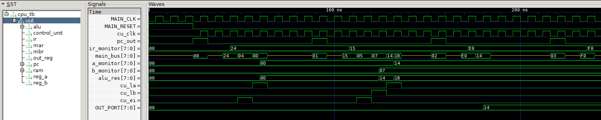

# 📊 Technical Report — Custom 8-Bit SAP-1 CPU

> **Project:** Custom 8-Bit Processor Based on SAP-1 Architecture  
> **Author:** Furkan Umut Topkır  
> **Date:** June 2026  
> **Contact:** furkan64umuttopkir@gmail.com

---

## 1. Project Overview

This report documents the specifications, design constraints, resource utilization, and performance characteristics of a custom 8-bit processor based on the SAP-1 (Simple As Possible) architecture. The entire CPU was designed from the ground up using only primitive logic gates, D flip-flops, and structural wiring — no pre-built components, no behavioral memory arrays, and no library modules were used.

| Item | Detail |
|---|---|
| **Design Methodology** | Bottom-up, gate-level structural design |
| **Prototyping Tool** | Logisim Evolution (interactive circuit simulation) |
| **HDL Implementation** | Structural Verilog HDL (1:1 translation from Logisim) |
| **Simulation Tool** | Icarus Verilog (iverilog + vvp) |
| **Waveform Analysis** | GTKWave |

---

## 2. System Specifications

### 2.1 Processor Core

| Parameter | Specification |
|---|---|
| Architecture | SAP-1 (Simple As Possible - 1), custom extensions |
| Data Bus Width | 8-bit, shared tri-state |
| Address Bus Width | 4-bit (effective), 8-bit (physical) |
| Instruction Width | 8-bit fixed-length |
| Instruction Format | `[OPCODE (4-bit)] [ADDRESS (4-bit)]` |
| Number of Instructions | 4 (LDA, ADD, OUT, HLT) |
| Max Addressable Memory | 16 bytes (4-bit address → 2⁴ = 16) |
| ALU Operations | Addition, Subtraction (two's complement) |
| ALU Architecture | 8-bit Ripple-Carry Adder/Subtractor |
| Register Width | 8-bit (all registers) |
| Clock Strategy | Single-phase, dual-edge (data: posedge, control: negedge) |
| Operating Modes | 2 (Programming Mode + Execution Mode) |

### 2.2 Register File

| Register | Width | Qty | Purpose | Bus Access |
|---|:---:|:---:|---|:---:|
| Program Counter (PC) | 8-bit | 1 | Holds current instruction address | Read |
| Instruction Register (IR) | 8-bit | 1 | Stores fetched instruction byte | Read (lower nibble only) |
| Accumulator (A) | 8-bit | 1 | Primary operand / ALU result | Read / Write |
| Register B | 8-bit | 1 | Secondary ALU operand | Write |
| Memory Address Register (MAR) | 8-bit | 1 | Holds RAM address for read/write | Write (dedicated wire to RAM) |
| Memory Buffer Register (MBR) | 8-bit | 1 | Staging buffer for RAM writes | Write (dedicated wire to RAM) |
| Output Register (OUT) | 8-bit | 1 | Latches final output value | Write |
| **Total** | — | **7** | — | — |

### 2.3 Memory Subsystem

| Parameter | Specification |
|---|---|
| Type | Static RAM (register-based, fully structural) |
| Total Capacity | 16 bytes (128 bits) |
| Organization | 4 banks × 4 cells × 8 bits |
| Address Decoding | Two-level: `ADRES[3:2]` → bank select, `ADRES[1:0]` → cell select |
| Decoder Type | Equality comparator (2-to-4, one-hot output) |
| Read Latency | Combinational (0 clock cycles — asynchronous read) |
| Write Latency | 1 clock cycle (synchronous write on posedge CLK) |
| Implementation | 16 × `register_unit_8b` (no behavioral `reg [7:0] mem[]`) |

### 2.4 Instruction Set Architecture (ISA)

| Opcode | Binary | Mnemonic | Operation | CPI (Cycles Per Instruction) |
|:---:|:---:|:---:|---|:---:|
| `0x1_` | `0001` | **ADD** | `A ← A + RAM[addr]` | 6 |
| `0x2_` | `0010` | **LDA** | `A ← RAM[addr]` | 5 |
| `0xE_` | `1110` | **OUT** | `OUT_PORT ← A` | 4 |
| `0xF_` | `1111` | **HLT** | Halt (freeze step counter) | 4 |

| ISA Property | Value |
|---|---|
| Instruction encoding | Fixed-length, 8-bit |
| Addressing modes | Direct only (4-bit absolute address) |
| Max instructions in memory | 16 (limited by 4-bit address space) |
| Branch/Jump support | Not implemented (PC increments only) |
| Interrupt support | None |

---

## 3. Design Constraints

### 3.1 Architectural Constraints

| Constraint | Description | Impact |
|---|---|---|
| 4-bit address space | Only 16 memory locations available | Programs limited to 16 bytes (instructions + data combined) |
| No pipeline | Single instruction processed at a time | CPI ranges from 4–6 depending on instruction |
| Shared bus | All data transfers via single 8-bit tri-state bus | Only one bus driver active per clock cycle |
| No flags register | ALU carry/overflow/zero flags not captured | Conditional branching impossible without hardware modification |
| Sequential PC only | Program Counter can only increment by 1 | No loops, no jumps, no subroutines |
| Fixed control sequence | 8-step counter (T0–T7), wraps every 8 cycles | T6–T7 are no-ops (wasted cycles for 6-step instructions) |

### 3.2 Timing Constraints

| Parameter | Value | Notes |
|---|---|---|
| Testbench Clock Period | 8 ns (125 MHz) | Simulation only — not a real hardware target |
| Clock Duty Cycle | 50% (4 ns high, 4 ns low) | |
| Data Latch Edge | Positive edge (`posedge CLK`) | All registers latch on rising edge |
| Control Advance Edge | Negative edge (`negedge CLK`) | Step counter advances on falling edge |
| Setup/Hold Time | Not modeled | Structural Verilog — no gate delay annotations |
| Reset Type | Asynchronous, active-high | Clears all registers and step counter immediately |
| Reset Duration (TB) | 24 ns (3 clock cycles) | Ensures clean initialization |

### 3.3 Bus Contention Rules

| Rule | Enforcement |
|---|---|
| Only one bus driver active per T-step | Control Unit generates mutually exclusive enable signals |
| PROG_MODE masks all CU bus drivers | `signal = cu_signal & ~PROG_MODE` |
| Manual overrides use OR-gating | `active_signal = (cu_signal & ~PROG_MODE) \| MANUAL_signal` |
| Undriven bus state | High-impedance (`8'bzzzzzzzz`) |

---

## 4. Resource Utilization

### 4.1 Component Count

| Component | Module Name | Instances | Sub-components per Instance | Total Primitives |
|---|---|:---:|---|:---:|
| 1-Bit Full Adder | `full_adder_1b` | 16 | 2 XOR + 2 AND + 1 OR | 80 gates |
| 8-Bit Register | `register_unit_8b` | 24 | 8 D-FF + 8 Tri-state buffers | 192 FF + 192 buffers |
| 8-Bit ALU | `alu_8b_add_sub` | 2 | 8 FA + 8 XOR | 2 × (80 + 8) = 176 gates |
| 4-Byte SRAM Bank | `sram_4byte` | 4 | 4 registers + 1 decoder + 4 AND | 4 × (32 FF + ...) |
| 16-Byte RAM | `ram_16byte` | 1 | 4 banks + 1 decoder + 8 AND | see sub-components |
| Control Unit | `control_unit_sap1_custom` | 1 | 3 JK-FF + decoders + logic | ~40 gates |
| Program Counter | `program_counter` | 1 | 1 register + 1 ALU + 1 AND | see sub-components |

### 4.2 Summary Totals

| Resource | Count |
|---|---|
| **D Flip-Flops** | 192 (24 registers × 8 bits) + 3 (step counter) + 1 (halted flag) = **196** |
| **Logic Gates (approx.)** | ~300 (ALU, decoders, control logic, address decoding) |
| **Tri-State Buffers** | 192 (register outputs) + 6 (bus drivers) = **~198** |
| **Total Verilog Modules** | 8 unique modules |
| **Total Verilog Source Lines** | 518 lines (RTL only, excluding testbench) |

### 4.3 Source Code Metrics

| File | Module | Lines | Role |
|---|---|:---:|---|
| `adder_1b.v` | `full_adder_1b` | 23 | Gate-level 1-bit full adder |
| `register_unit_8b.v` | `register_unit_8b` | 29 | Universal 8-bit register |
| `alu_8b_add_sub.v` | `alu_8b_add_sub` | 35 | 8-bit ripple-carry ALU |
| `program_counter.v` | `program_counter` | 39 | PC with ALU-based increment |
| `sram_4byte.v` | `sram_4byte` | 69 | 4-byte addressable memory bank |
| `ram_16byte.v` | `ram_16byte` | 79 | 16-byte RAM (4 banks) |
| `control_unit_sap1_custom.v` | `control_unit_sap1_custom` | 85 | FSM control unit |
| `cpu_top_sap1.v` | `cpu_top_sap1` | 159 | Top-level integration |
| `cpu_tb.v` | `cpu_tb` | 110 | Testbench |
| **Total** | **9 modules** | **628** | — |

---

## 5. Performance Analysis

### 5.1 Cycles Per Instruction (CPI)

| Instruction | Fetch Cycles (T0–T2) | Execute Cycles (T3–T5) | Total CPI | Description |
|:---:|:---:|:---:|:---:|---|
| **LDA** | 3 | 2 (T3, T4) | **5** | Load from RAM into accumulator |
| **ADD** | 3 | 3 (T3, T4, T5) | **6** | Load from RAM into B, compute A+B, store to A |
| **OUT** | 3 | 1 (T3) | **4** | Copy accumulator to output register |
| **HLT** | 3 | 1 (T3) | **4** | Set halted flag, freeze counter |

> **Note:** The step counter wraps at 8 (3-bit counter: 0–7). Instructions using fewer than 8 steps have T6–T7 as idle no-op cycles before the next fetch begins. The "Total CPI" column shows the **useful** cycles; the **effective CPI** is always 8 due to the fixed-width counter.

### 5.2 Effective CPI and Throughput

| Metric | Value | Calculation |
|---|---|---|
| Effective CPI (all instructions) | **8 cycles** | Fixed 3-bit step counter wraps at 8 |
| Clock Period (Testbench) | 8 ns | `always #4 MAIN_CLK = ~MAIN_CLK` |
| Clock Frequency (Testbench) | 125 MHz | 1 / 8 ns |
| Instruction Throughput | **15.625 MIPS** | 125 MHz / 8 CPI |
| Time per Instruction | **64 ns** | 8 cycles × 8 ns |

### 5.3 Test Program Performance — `program.hex`

The default test program computes `13 + 7 = 20`:

```
Address  Hex    Instruction    Effective CPI
0x0      0x24   LDA 0x4        8 cycles
0x1      0x15   ADD 0x5        8 cycles
0x2      0xE0   OUT            8 cycles
0x3      0xF0   HLT            4 cycles (halts mid-cycle)
0x4      0x0D   (data: 13)
0x5      0x07   (data: 7)
```

| Metric | Value |
|---|---|
| Total Instructions Executed | 4 (LDA + ADD + OUT + HLT) |
| Total Clock Cycles | 28 (8 + 8 + 8 + 4) |
| Total Execution Time | 224 ns (28 × 8 ns) |
| Simulation Duration (TB) | 600 ns (includes reset + margin) |
| Final Output (`OUT_PORT`) | `0x14` (20 decimal) ✅ |

### 5.4 ALU Propagation Delay Analysis

The ALU uses a **ripple-carry** architecture where the carry must propagate through all 8 full adders sequentially. This is the critical timing path.

| Parameter | Value |
|---|---|
| Single Full Adder Delay | 2 gate delays (XOR → XOR for Sum, AND/OR for Carry) |
| Carry Chain Delay (worst case) | 8 × 2 = **16 gate delays** |
| Sum Output Delay (worst case) | 15 gate delays (carry chain) + 1 XOR = **16 gate delays** |
| Typical Gate Delay (CMOS) | ~0.1–1 ns per gate (technology dependent) |
| Estimated Max ALU Delay | 1.6–16 ns (depending on target technology) |

| Alternative ALU Architectures | Delay | Complexity | Notes |
|---|:---:|:---:|---|
| **Ripple-Carry (current)** | O(n) = 16 gates | Low | Simple, small area, used in this project |
| Carry-Lookahead (CLA) | O(log n) = 4 gates | Medium | 4× faster, ~2× more gates |
| Carry-Select | O(√n) = 6 gates | High | Duplicates adder blocks |

> At the testbench clock of 125 MHz (8 ns period), the ripple-carry adder must complete within one half-cycle (~4 ns). This is achievable in modern CMOS technology where gate delays are typically < 0.5 ns.

### 5.5 Control Unit Timing

| Parameter | Value |
|---|---|
| Step Counter Width | 3 bits |
| Step Counter Range | 0–7 (8 states) |
| Useful States | T0–T5 (6 states) |
| Wasted States | T6–T7 (2 states, no-ops) |
| Counter Efficiency | 75% (6 useful / 8 total) |
| Advance Edge | Negative edge (`negedge CLK`) |
| Half-Cycle Offset Purpose | Control signals settle before next posedge latches data |

---

## 6. Verification Results

### 6.1 Test Program: Addition (13 + 7)

| Clock Cycle | Step | Signal Activity | Register Changes |
|:---:|:---:|---|---|
| 1–3 | T0–T2 | Fetch instruction at PC=0 | IR ← `0x24` (LDA 0x4) |
| 3 | T3 | EI=1, LM=1: IR[3:0] → MAR | MAR ← `0x04` |
| 4 | T4 | RO=1, LA=1: RAM[4] → A | A ← `0x0D` (13) |
| 5–7 | T5–T7 | No-ops (counter wrapping) | — |
| 8–10 | T0–T2 | Fetch instruction at PC=1 | IR ← `0x15` (ADD 0x5) |
| 11 | T3 | EI=1, LM=1: IR[3:0] → MAR | MAR ← `0x05` |
| 12 | T4 | RO=1, LB=1: RAM[5] → B | B ← `0x07` (7) |
| 13 | T5 | ALU_OUT=1, LA=1: A+B → A | A ← `0x14` (20) ✅ |
| 14–15 | T6–T7 | No-ops | — |
| 16–18 | T0–T2 | Fetch instruction at PC=2 | IR ← `0xE0` (OUT) |
| 19 | T3 | LO=1, A_OUT=1: A → OUT | OUT_PORT ← `0x14` (20) ✅ |
| 20–23 | T4–T7 | No-ops | — |
| 24–26 | T0–T2 | Fetch instruction at PC=3 | IR ← `0xF0` (HLT) |
| 27 | T3 | HLT detected | halted ← 1, CPU stops ✅ |

### 6.2 Verification Summary

| Test Case | Input | Expected Output | Actual Output | Status |
|---|---|---|---|:---:|
| Addition 13 + 7 | `program.hex` (default) | `OUT_PORT = 0x14` (20) | `0x14` (20) | ✅ PASS |
| LDA loads correct value | RAM[4] = 0x0D | A = 0x0D after T4 | 0x0D | ✅ PASS |
| ADD loads B correctly | RAM[5] = 0x07 | B = 0x07 after T4 | 0x07 | ✅ PASS |
| ALU computes correctly | A=0x0D, B=0x07 | ALU = 0x14 | 0x14 | ✅ PASS |
| HLT stops execution | Opcode = 0xF | halted = 1 | halted = 1 | ✅ PASS |
| PC increments correctly | Start at 0 | 0 → 1 → 2 → 3 | 0 → 1 → 2 → 3 | ✅ PASS |
| Reset clears all | MAIN_RESET = 1 | All registers = 0 | All = 0 | ✅ PASS |

### 6.3 Simulation Waveform



---

## 7. Limitations and Known Issues

| # | Limitation | Severity | Workaround / Future Fix |
|:---:|---|:---:|---|
| 1 | Only 16 bytes of RAM | Medium | Expand to 8-bit address (256 bytes) |
| 2 | No SUB instruction in CU | Low | ALU supports it; add opcode `0011` to CU |
| 3 | No jump/branch instructions | High | Add JMP (direct PC load), JZ/JC (conditional) |
| 4 | No flags register | High | Add Zero, Carry, Overflow flags from ALU output |
| 5 | T6–T7 wasted cycles | Low | Optimize to variable-length micro-steps |
| 6 | No gate delay modeling | Low | Add `#delay` annotations for timing-accurate simulation |
| 7 | Single test program | Low | Create additional test cases for edge cases |
| 8 | No STA (store) instruction | Medium | Add write-back path from A to RAM |

---

## 8. Comparison with Reference Architecture

| Feature | Original SAP-1 (Malvino) | This Implementation |
|---|---|---|
| Data bus | 8-bit | 8-bit ✅ |
| Address space | 16 bytes | 16 bytes ✅ |
| Instructions | LDA, ADD, SUB, OUT, HLT | LDA, ADD, OUT, HLT (no SUB opcode) |
| ALU | Add only | Add + Subtract (hardware ready) |
| RAM | Behavioral | Fully structural (register-based) ✅ |
| Control Unit | ROM-based microcode | Hardwired FSM (combinational logic) |
| Programming | DIP switches | Dual-mode (PROG_MODE switch) |
| MBR register | Not in original | Added for cleaner write path ✅ |
| Clock edges | Single edge | Dual-edge (pos: data, neg: control) ✅ |

---

## 9. FPGA Synthesis Estimate

> ⚠️ **Note:** This project has not been synthesized to FPGA yet. The values below are rough estimates based on the structural design.

| FPGA Resource | Estimated Usage | Typical Budget (Artix-7 XC7A35T) | Utilization |
|---|:---:|:---:|:---:|
| Flip-Flops (FF) | ~196 | 41,600 | < 0.5% |
| LUTs (Look-Up Tables) | ~300 | 20,800 | ~1.4% |
| I/O Pins | ~25 | 210 | ~12% |
| Block RAM | 0 (register-based) | 50 × 36Kb | 0% |
| Max Clock Frequency (est.) | 100–200 MHz | — | — |

The design is intentionally minimal and would fit on virtually any FPGA, including the smallest devices available.

---

## 10. Conclusion

This project successfully demonstrates a fully functional 8-bit processor built entirely from primitive logic gates. The bottom-up design methodology — starting from a single 1-bit full adder and scaling up through registers, memory banks, an ALU, and a control unit — proves that complex digital systems can be understood and constructed from first principles.

| Achievement | Detail |
|---|---|
| ✅ Gate-level design | Every component built from AND, OR, XOR, NOT gates |
| ✅ Structural RAM | 16 bytes from 192 D flip-flops, no behavioral arrays |
| ✅ Dual-mode operation | Programming Mode + Execution Mode |
| ✅ Correct computation | 13 + 7 = 20 verified in simulation |
| ✅ Logisim → Verilog | 1:1 faithful translation, both environments produce identical results |
| ⬜ FPGA synthesis | Planned for future work |
| ⬜ Extended ISA | SUB, JMP, JZ, STA instructions planned |

---

> **References:**
> 1. Albert Paul Malvino, Jerald A. Brown — *Digital Computer Electronics* (3rd Edition)
> 2. M. Morris Mano — *Digital Logic and Computer Design*
> 3. M. Morris Mano — *Computer System Architecture*
